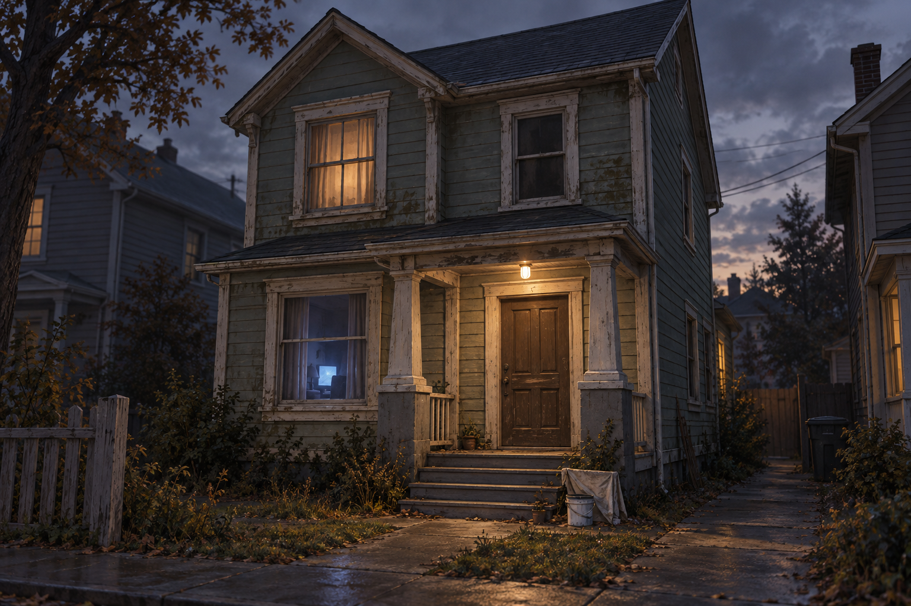
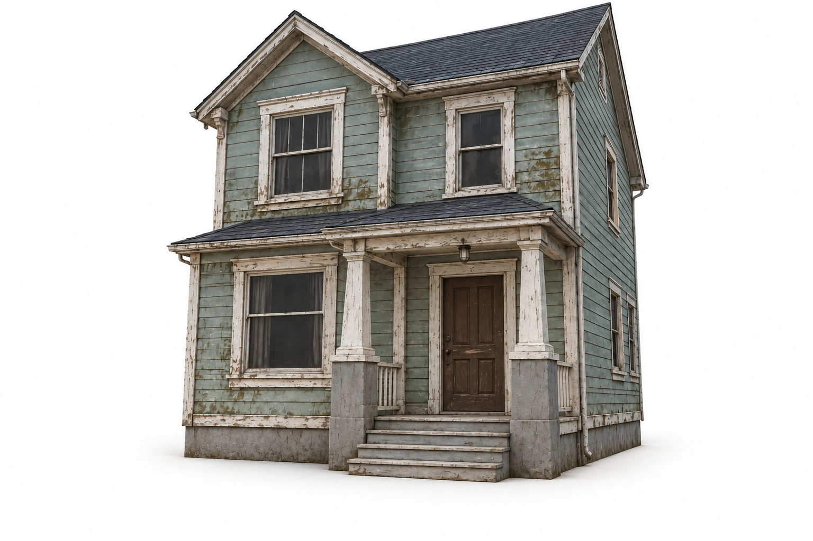
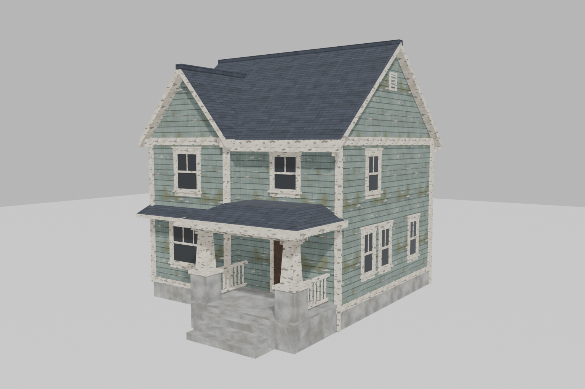

# First Job — The Occupied House

Exterior concept accepted by the owner on September 21, 2026. [Proposed floor plan and interior objects](first-job-interior.md).

[Open or download the full-size concept](images/first-job-house-v1.png)

## Isolated house — September 22, 2026

[Open or download isolated house](images/first-job-house-isolated-v1.png). Edited with the built-in image generator from the accepted exterior; surrounding scenery, loose props and visible furnished interiors removed. Original preserved. This image depicts an exterior shell; it does not establish actual empty interior geometry. [Exact edit prompt](first-job-house-isolated-prompt.txt).

## Original concept direction

Adapt the brief's first listed job, **The Occupied Apartment**, into a modest urban family house. This is a proposed adaptation, not an established mission order. The customer appears to be home but never answers: a television glows downstairs, a warm light shines behind upstairs curtains, and the neighboring window remains dark.

Faded sage-gray siding, dirty cream trim, brown wood and charcoal shingles carry the muted palette. The warm porch light draws the player toward the front door. Peeling paint establishes an ordinary painting contract before the haunting begins.

## Modeling and review

Use a compact two-story shell, simple pitched roof, shallow porch and repeated window modules. Preserve the oversized trim and sturdy porch posts; simplify fine surface damage into material treatment. Interior layout and dimensions are not established by this image.

Visual review: the entry, material separation and warm/cold lighting are readable. The image is more realistic and finely distressed than the intended chunky stylized 3D direction; treat it as a mood and architecture exploration, not an approved final style or measured modeling reference.

Generated with the built-in image generator. [Exact generation prompt](first-job-house-prompt.txt).

## Game-ready model — September 25, 2026

[Front three-quarter](3d/first-job-house/previews/SM_FirstJobHouse_front_three_quarter.png) · [Front](3d/first-job-house/previews/SM_FirstJobHouse_front.png) · [Back left](3d/first-job-house/previews/SM_FirstJobHouse_back_left.png)

Built procedurally in Blender 5.2 from the isolated reference. [Build script](3d/first-job-house/build_first_job_house.py) · [Blender source](3d/first-job-house/SM_FirstJobHouse.blend) · [Unreal FBX](3d/first-job-house/SM_FirstJobHouse.fbx) · [Build report](3d/first-job-house/build_report.json)

- `SM_FirstJobHouse`: 3,664 triangles, 7 materials, solid exterior shell with a closed front door and no interior.
- Size 8.65 × 11.33 × 9.64 m, including the porch steps. Pivot at ground level in the centre of the main footprint. Front faces −Y in Blender.
- UV0 holds tiling world-scale material UVs; UV1 holds non-overlapping lightmap UVs.
- 13 convex `UCX_` collision hulls, with a walkable ramp over the steps and blocking hulls for the porch railings.
- 1024² textures in `Textures/`: base color, OpenGL normals for Blender, and DirectX `_N_DX` normals, which the FBX references for Unreal.

**Unreal import:** drag in the FBX with default settings. Leave *Generate Lightmap UVs* unchecked, or set its source to UV channel 1. The engine picks up the collision automatically.
**Not yet verified:** the Unreal import itself. Only a Blender FBX round trip was tested.
