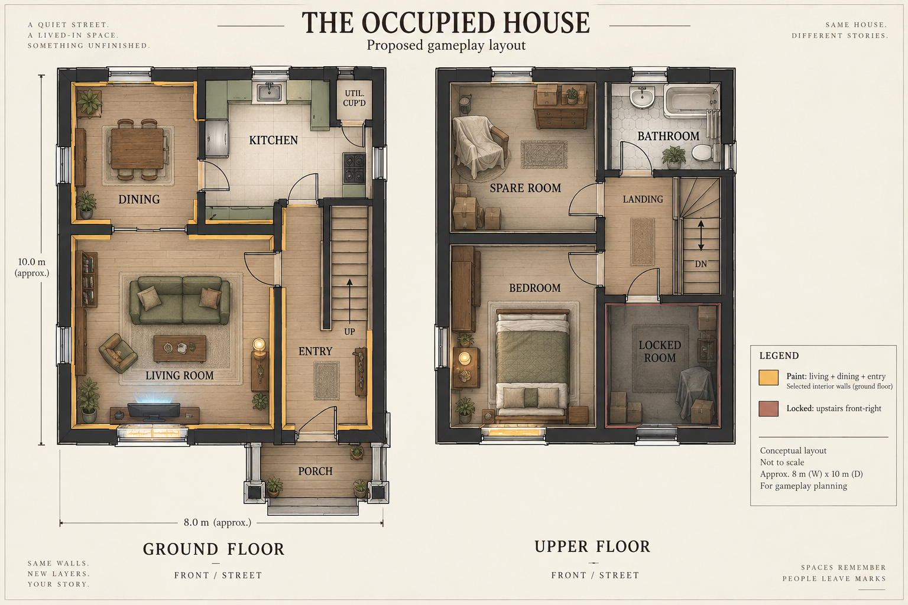
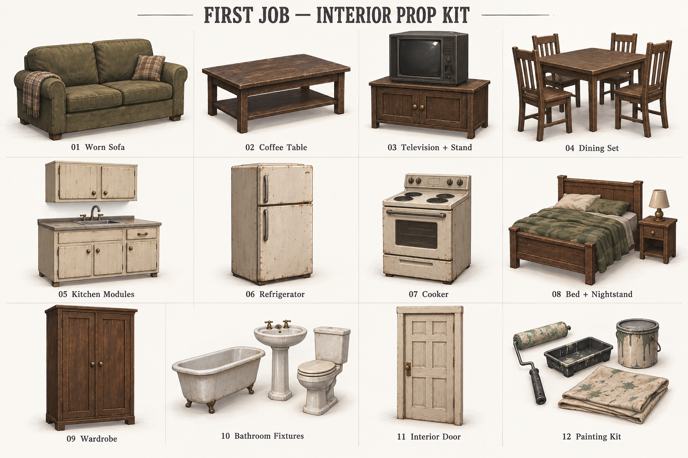
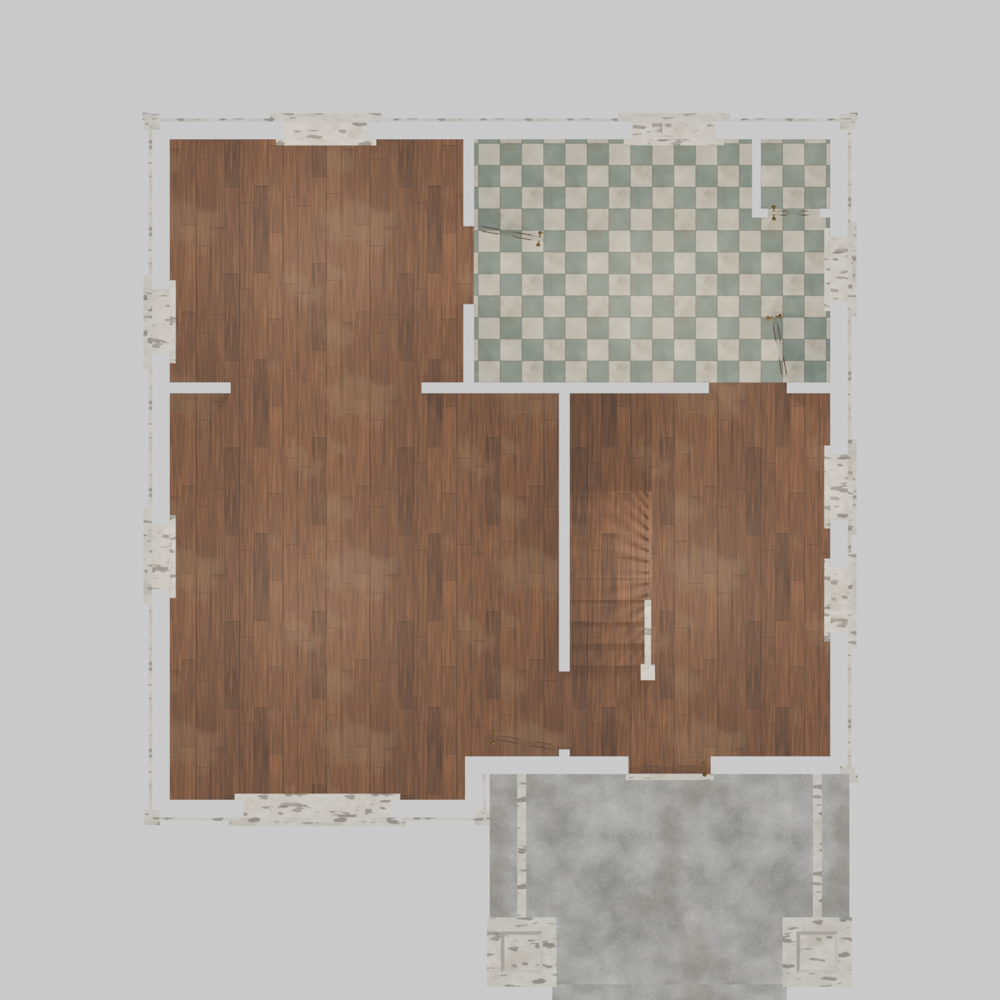
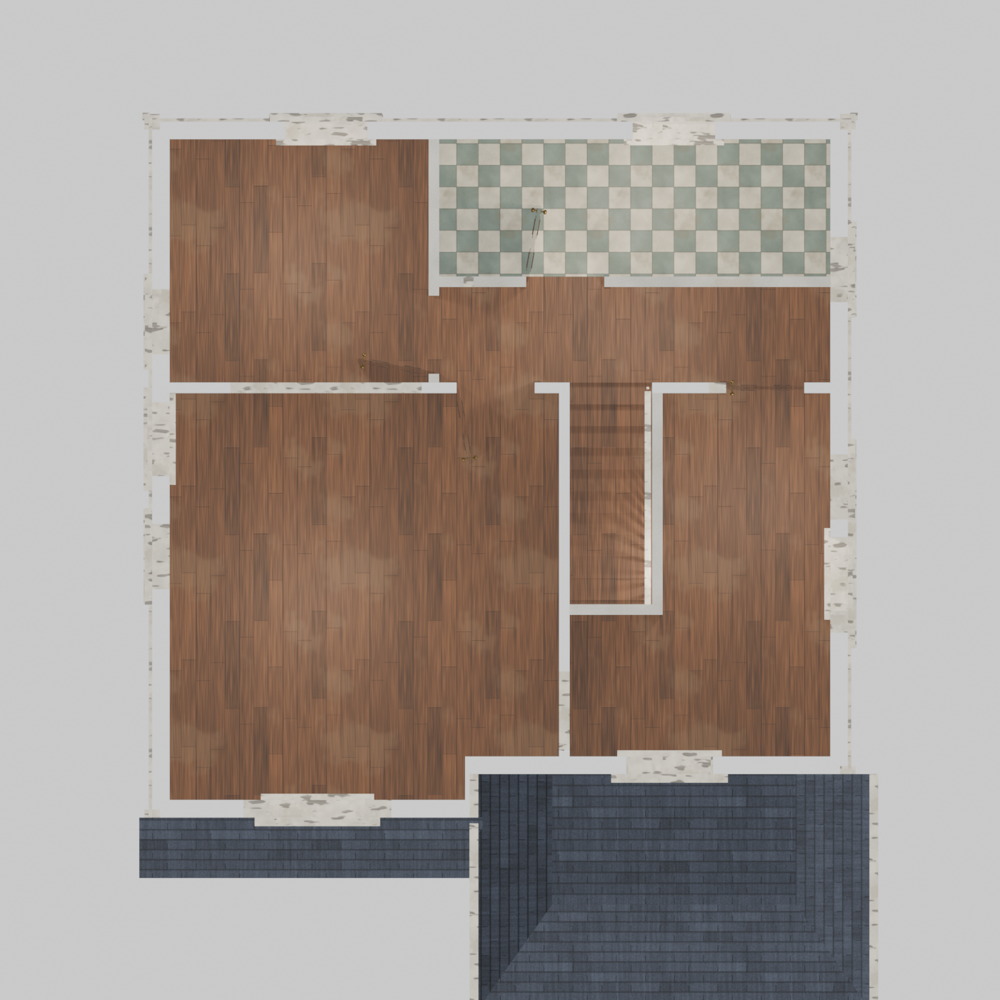
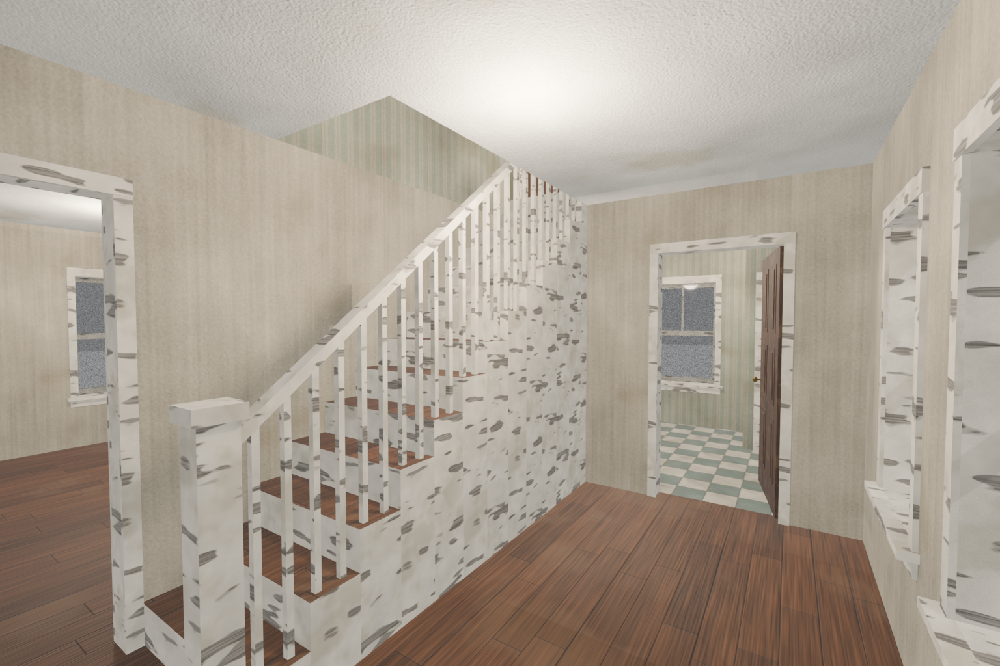

# First Job — Floor Plan and Interior Objects

Proposed interior for the accepted house exterior. September 21, 2026.

## Furnished floor plan

[Open or download floor plan](images/first-job-floorplan-v1.png)

The street is at the bottom of both plans. Start with an approximately **8 × 10 m house shell**, excluding the front porch. These are proposed game-blockout dimensions, not measurements recovered from the exterior.

| Floor | Front left | Front right | Rear left | Rear right |
| --- | --- | --- | --- | --- |
| Ground | Living room; television visible through front window | Entrance and stair corridor | Dining room | Kitchen and utility cupboard |
| Upper | Main bedroom; warm front window | Locked room; dark front window | Spare room | Bathroom; landing beside stair arrival |

**Connections:** porch → entry → living → dining → kitchen → entry forms a short downstairs loop. Entry → stairs → upper landing/hall → each of the four upstairs rooms. The locked room has a normal door accessible from the hall, but remains unavailable during this first contract.

**Painting scope:** living room, dining room and entry walls only. Kitchen and upstairs provide context and suspense without requiring the player to repaint the whole house.

**First-job sequence:** enter and read instructions; move the sofa and dining furniture inward; protect the floor; paint the living room; investigate an upstairs footstep from the landing; return to finish dining and entry; leave through the same front door. The television and warm bedroom imply someone is home. Avoid a visible monster or a forced locked-exit event in this introductory proposal.

## Interior prop concept sheet

[Open or download prop sheet](images/first-job-props-v1.png)

These are **12 concept groups**, not 12 finished models. Sets contain multiple reusable objects.

| Area | Main objects | Small dressing | Gameplay purpose |
| --- | --- | --- | --- |
| Porch / entry | Door, doormat, narrow shoe shelf, wall light | Shoes, unopened mail, customer instruction note | Arrival, objective, equipment staging |
| Living | Two-seat sofa, coffee table, CRT television and stand, armchair, floor lamp | Rug, curtains, wall clock, two family photographs | Sofa moves for preparation; television supplies sound and cold light |
| Dining | One table and four instances of one chair model, small sideboard | Two mugs, plate, curtain | Furniture movement tutorial; apparently recent meal |
| Kitchen | Reusable base/upper cabinets, sink, fridge, cooker, trash bin | Kettle, dishes, dish towel, fridge note | Ordinary domestic context; no painting objective |
| Main bedroom | Double bed, bedside table, lamp, wardrobe | Curtains, slippers, laundry basket | Explains the warm upstairs window |
| Spare room | Dresser, reused armchair under a sheet, three box variants | Folded linen, empty picture frame | Low-cost storage space; ambiguous covered silhouette |
| Bathroom | Tub, sink, toilet, mirror, towel rail | Towel, soap, bathmat | Small believable service room above kitchen |
| Locked room | Reused chair, boxes, curtain, standard door with lock | Minimal contents only | Sound source; no fully dressed hidden room required until opened in a later design |
| Player equipment | Roller, tray, bucket, folded/spread drop cloth, tool bag | Tape, brush, scraper, rag | Core painting and preparation interactions |

## Build order and reuse

1. **Playable shell:** floors, walls, window/door openings, porch, stair and upper landing. Check the route in first person before furniture.
2. **Core job kit:** roller, tray, bucket, drop cloth, movable sofa/table/chairs, television, locked door.
3. **Large dressing:** cabinets, appliances, bed, wardrobe and bathroom set.
4. **Story details:** note, mugs, photographs, curtains and one sound cue. Add clutter only where it helps the story.

Reuse one interior door with material/lock variants, one dining chair instanced four times, a small family of boxes, and shared cream-painted wood and brown-wood materials. Keep the ordinary locked door rather than adding chains that announce the haunting.

## Blockout constraints and visual review

- Preserve the exterior's front-right entrance, front-left television window and two upper front windows. Side/rear openings remain proposals.
- Start with 2.7 m clear ceiling height, 0.9 m clear door openings and at least 1.2 m clear main circulation. These are gameplay starting values to test against the chosen player controller.
- Allow roughly 0.8–1.0 m working space between moved furniture and painting walls. The illustration shows furnished positions, not every preparation state.
- **Stair correction:** the generated sheet depicts different stair lengths and a turn at the upper end. In the blockout, use one shared straight stair footprint, rising rearward, with a matching upper floor opening and a clear top landing. Test headroom and door swings in section; do not trace the two illustrated stairs independently.
- The living-to-dining connection is visually ambiguous in the illustration: build it as an open passage, not a window or sealed partition.
- The locked door is drawn with a swing symbol to show its connection; its gameplay state is closed and locked.
- Prop shapes and labels are readable. The sheet uses more realistic surface wear than the original stylized brief, consistent with the accepted exterior. Simplify surface noise when modeling.
- Images were visually inspected; local files and registry links were checked. Workspace desktop wide/narrow preview controls have not been tested in this session.
- Concept images only: no dimensioned CAD plan, meshes, textures or engine scene were produced.

Generated with the built-in image generator using the accepted exterior as reference. Exact prompts: [floor plan](first-job-floorplan-prompt.txt) · [props](first-job-props-prompt.txt).

## Walkable house in Blender — September 25, 2026

Build-order step 1, the playable shell, built in Blender 5.2 from the accepted exterior and this floor plan. The existing [solid exterior model](first-job-house.md#game-ready-model--september-25-2026) is unchanged.

Previews: [ground plan](3d/first-job-house-walkable/previews/SM_FirstJobHouse_Walkable_plan_ground.png) · [upper plan](3d/first-job-house-walkable/previews/SM_FirstJobHouse_Walkable_plan_upper.png) · [entry](3d/first-job-house-walkable/previews/SM_FirstJobHouse_Walkable_interior_entry.png) · [living room](3d/first-job-house-walkable/previews/SM_FirstJobHouse_Walkable_interior_living.png) · [landing](3d/first-job-house-walkable/previews/SM_FirstJobHouse_Walkable_interior_landing.png) · [front three-quarter](3d/first-job-house-walkable/previews/SM_FirstJobHouse_Walkable_front_three_quarter.png) · [back left](3d/first-job-house-walkable/previews/SM_FirstJobHouse_Walkable_back_left.png)

Files: [build script](3d/first-job-house-walkable/build_first_job_house_walkable.py) · [Blender source](3d/first-job-house-walkable/SM_FirstJobHouse_Walkable.blend) · [house FBX](3d/first-job-house-walkable/SM_FirstJobHouse_Walkable.fbx) · door FBX: [front](3d/first-job-house-walkable/SM_FJH_Door_Front.fbx), [interior](3d/first-job-house-walkable/SM_FJH_Door_Interior.fbx), [cupboard](3d/first-job-house-walkable/SM_FJH_Door_Cupboard.fbx) · [door placements](3d/first-job-house-walkable/door_placements.json) · [build report](3d/first-job-house-walkable/build_report.json)

**Fitting the plan to the exterior.** The accepted exterior is 8 × 7.5 m plus a 0.5 m front bay, not the plan's approximate 8 × 10 m. Rooms keep the plan's arrangement and connections but are smaller. The rear rooms are 2.8 m deep.

| Floor | Room | Area | Walls |
| --- | --- | --- | --- |
| Ground | Living room (includes bay) | 20.4 m² | `M_WallPaint_Living` (paint target) |
| Ground | Entry and stair hall | 12.5 m² | `M_WallPaint_Entry` (paint target) |
| Ground | Dining room | 9.5 m² | `M_WallPaint_Dining` (paint target) |
| Ground | Kitchen + utility cupboard | 10.7 + 0.6 m² | wallpaper, tile floor |
| Upper | Bedroom (front left) | 20.4 m² | wallpaper |
| Upper | Locked room (front right, L-shaped) | 9.8 m² | wallpaper |
| Upper | Landing | 5.0 m² | wallpaper |
| Upper | Spare room | 8.3 m² | wallpaper |
| Upper | Bathroom | 7.1 m² | wallpaper, tile floor |

- **Downstairs loop:** porch → entry → living → open cased arch → dining → kitchen → entry. Each of the three paint rooms has its own material slot, so the engine can track and tint them independently.
- **Stair:** one straight flight along the living-room wall, rising rearward, as the blockout constraint requires. It has 14 risers of 0.20 m, 13 treads of 0.25 m, a width of 0.95 m and a pitch of 38.7°, with 2.0 m minimum headroom. The open hall side has a balustrade. The collision ramp runs along the nosings, below the Unreal default walkable angle of 44.76°.
- **Heights:** ground floor 0.9 m, ground ceiling 2.6 m clear, upper floor 3.7 m. The upper ceiling is 2.35 m clear, limited by the existing eave. Every doorway is 0.9 × 2.1 m clear except the 0.6 × 2.0 m cupboard.
- **Doors:** separate leaves with the pivot on the hinge. `door_placements.json` gives each location, closed yaw and opening direction. The front, locked and cupboard doors are closed in the saved scene; the rest are open. The locked door uses the ordinary interior leaf.
- **Mesh:** 5,341 triangles and 13 materials, with 135 convex `UCX_` hulls covering walls, floors, ceilings, window glass, the stair ramp, the balustrade, the roof and the porch. UV0 is tiling world-scale; UV1 holds lightmap UVs. Door leaves have one hull each: interior and cupboard doors have 1,722 triangles and the front door 1,122.
- **Door hardware:** aged-brass knobs (`M_BrassAged`, with a tarnish texture). Interior and cupboard doors have a turned rosette and a round keyhole escutcheon; the front door has a period backplate with the keyhole on it. The knob sits 0.97 m above the leaf bottom, 65 mm from the latch edge, on both faces. [Close-up](3d/first-job-house-walkable/previews/SM_FirstJobHouse_Walkable_door_knob.png)
- **Hidden-face cleanup (September 26):** the build deletes every face a camera cannot see: 1,790 double faces at joins between wall pieces, faces buried inside other solids (the backs of trim, the undersides of walls, floors and stair blocks where they meet), faces facing into the sealed attic, and bottom faces resting on the ground. The house went from 12,592 to 5,341 triangles. An exact scan found 57 overlapping same-facing faces, all on the exterior and inherited from the shell (foundation, skirt, corner and frieze boards, vents, ridge caps, porch deck, piers, steps and fascia, gutter joints); each was fixed at its source, and the scan now reports none. Glass never counts as hiding anything. Faces only partly hidden are kept whole. The counts are in `build_report.json` under `cleanup`.
- **Exterior change:** the upper window on the left side moved 0.15 m forward so the bedroom/spare-room partition clears it. The windows now have glass and interior casings.

**Checks:** an FBX round trip in Blender re-imported all four files with matching names, `UCX_` collision, both UV channels, DirectX normal maps and correct sizes. The interior and plan previews were inspected visually.

**Not yet verified:** the Unreal import, the conversion of door placements to Unreal coordinates, and a first-person walk with the chosen player controller. Unreal needs a translucent glass material; the Blender glass is a preview only. Skirting boards, furniture and lighting come in later build-order steps.
